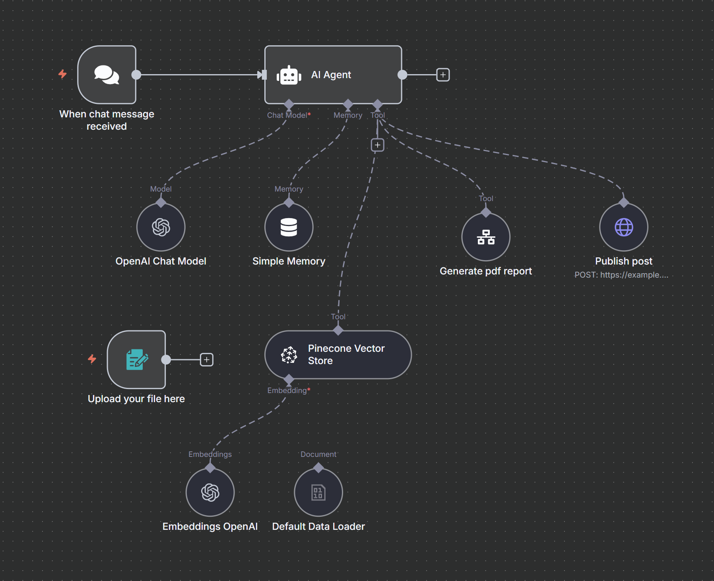
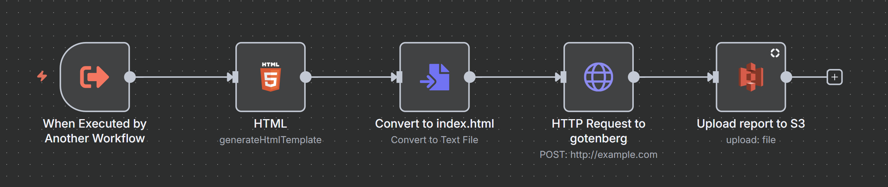

# 🤖 AI Assistant for ESPI/EBI Reports

**AI Assistant for ESPI/EBI Reports** is an intelligent automation agent built with [n8n](https://n8n.io/) that generates and publishes ESPI (Current Reports) and EBI reports for public companies.  
It supports the preparation of stock transaction announcements and automatically publishes them on a CMS website.

---

## ⚙️ Architecture Overview

### Core Components

- **OpenAI Chat Model** – Generates the report text based on prompts and structured context.
- **Simple Memory** – Keeps conversation state and report parameters across interactions.
- **Pinecone Vector Store** – Retrieves examples of high-quality past reports for context and consistency.
- **Generate PDF Report** – Produces the final ESPI report in PDF format using the provided HTML structure.
- **Publish Post** – Automatically posts the finished report to a CMS website.
- **Upload File** – Optional node for uploading reference documents or templates.

---

## 🧠 Agent Logic – “AI Assistant for ESPI/EBI Reports”

The agent operates in **two main stages**.

### **Stage 1 – Data Collection and Report Generation**

The assistant first collects the necessary data to generate an ESPI report.  
It asks the user for specific details, automatically fills in standard elements, and prepares the HTML version for PDF generation.

### **Stage 2 – Publishing the Report in CMS**

Once the report is ready, the assistant asks:

> “Would you like to publish the report on the website?”

If the user confirms, it triggers the **Publish Post to CMS** tool.

### **Stage 3 – Publishing the Report in ESPI / EBI**

After the report is published in CMS, the assistant asks:

> "Do you want to publish the report in ESPI / EBI?"

If the user confirms, it triggers the **Publish to ESPI/EBI** tool.